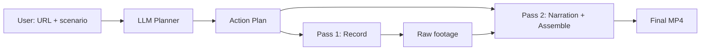

# ShowZo — Agentic Walkthrough Video Generator

**ShowZo** turns any URL + scenario description into a polished product walkthrough video, fully automated. It uses agent-browser to drive the browser, Edge TTS for narration, and ffmpeg to stitch it all together.



Built for the Zo Ambassador Hackathon — and itself recorded using ShowZo.

## Quick Start

```bash
bun install
bun run pipeline/plan.ts --url https://example.com --scenario "Walk through the login flow"
bun run pipeline/walkthrough.ts --plan plan.json
bun run pipeline/assemble.ts --plan plan.json --recording raw-recording.webm
```

## Web UI (coming)

```
bun run dev
```

Opens at `http://localhost:3000` — paste a URL, describe what to show, review the plan, hit record.

## Architecture

| Layer | Location | Tech |
|-------|----------|------|
| Web UI | `app/` | React + Vite |
| API / Orchestrator | `app/api/` | Hono |
| Pipeline | `pipeline/` | Bun scripts |
| Shared Types | `shared/` | TypeScript |

## Repo

- [Issues](https://github.com/CCAgentOrg/ShowZo/issues) — full backlog
- [Epics](https://github.com/CCAgentOrg/ShowZo/issues?q=is%3Aissue+is%3Aopen+label%3Aepic) — Core Pipeline, Web UI, Dogfooding
